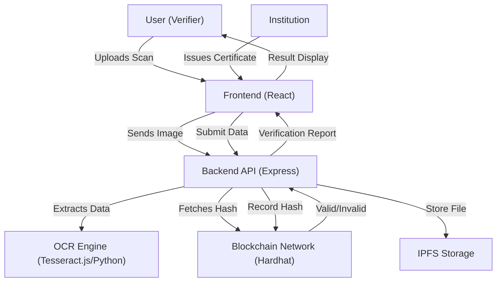

# Authenticity Validator for Academia (SIH'25)


A comprehensive digital platform developed for the **Smart India Hackathon 2025** to detect fake degrees and forged academic certificates. This system combines **Optical Character Recognition (OCR)** for physical document scanning and **Blockchain technology** for tamper-proof digital verification.

---

## 🚀 Key Features

-   **Hybrid Verification**: Validates both physical certificates (via OCR) and digital records (via Blockchain hash).
-   **Tamper-Proof Ledger**: Stores certificate hashes on a decentralized blockchain network, ensuring immutable records.
-   **Dual-Role Dashboard**: tailored interfaces for **Institutions** (to issue/upload records) and **Verifiers** (employers/agencies to check credentials).
-   **Bulk Upload**: Institutions can upload multiple student records simultaneously.
-   **OCR Integration**: automatically extracts Name, Roll Number, and Marks from scanned certificate images.
-   **Secure Storage**: Uses IPFS for decentralized storage of certificate metadata and files.

---

## 🏗 System Architecture



---

## 🛠 Tech Stack

### **Frontend**
-   **Framework**: [React](https://react.dev/) (Vite)
-   **Styling**: [Tailwind CSS v4](https://tailwindcss.com/)
-   **State Management**: React Hooks

### **Backend**
-   **Runtime**: [Node.js](https://nodejs.org/)
-   **Framework**: [Express.js](https://expressjs.com/)
-   **Blockchain**: Hardhat (Local Ethereum Network)
-   **Contract Language**: Solidity
-   **Storage**: IPFS (InterPlanetary File System)
-   **Utilities**: Multer (File Uploads), Axios

---

## 🏁 Getting Started

### Prerequisites
-   **Node.js** (v18+)
-   **npm**
-   **MetaMask** (Optional for browser interaction)

### Option 1: Manual Setup 🛠️

#### 1. Start the Blockchain Node
```bash
cd Backend
npm install
npx hardhat node
```
*Keep this terminal running to maintain the local blockchain network.*

#### 2. Deploy Contracts & Start Backend
Open a new terminal:
```bash
cd Backend
# The server script handles contract deployment on start
npm start
# OR
node server.js
```
The server will run on `http://localhost:3001` and deploy the smart contract to your local node.

#### 3. Start the Frontend
Open a third terminal:
```bash
cd front-end
npm install
npm run dev
```
Access the application at `http://localhost:5173`.

---

## 📖 Usage Guide

### 1. For Institutions (Issuers)
1.  Log in to the Institution Dashboard.
2.  Navigate to **Issue Certificate**.
3.  Fill in student details or upload a bulk CSV/Excel file.
4.  Click **Issue**. The system generates a hash and stores it on the blockchain.

### 2. For Verifiers (Employers)
1.  Go to the **Verify** page.
2.  Upload a scanned copy of the certificate OR enter the unique Certificate ID.
3.  The system uses OCR to read the scan and checks the extracted data against the blockchain records.
4.  **Result**: Instant feedback on whether the certificate is "Authentic" or "Not Found/Forged".

---

## 📂 Project Structure

```bash
Authenticity-Validator-for-Academia-SIH25/
├── Backend/
│   ├── Contracts/       # Solidity Smart Contracts
│   ├── Services/        # Business logic & Blockchain interaction
│   ├── Routes/          # API Routes (Auth, Issues, Verify)
│   ├── Model/           # Data Models
│   └── server.js        # Entry point
├── front-end/
│   ├── src/             # React application source
│   ├── public/          # Static assets
│   └── vite.config.js   # Vite configuration
└── README.md            # You are here
```

---

## 🤝 Contributing

Contributions are welcome! Please fork the repository and create a pull request with your changes.

1.  Fork the Project
2.  Create your Feature Branch
3.  Commit your Changes
4.  Push to the Branch
5.  Open a Pull Request

---

## 📄 License

This project is licensed under the MIT License.